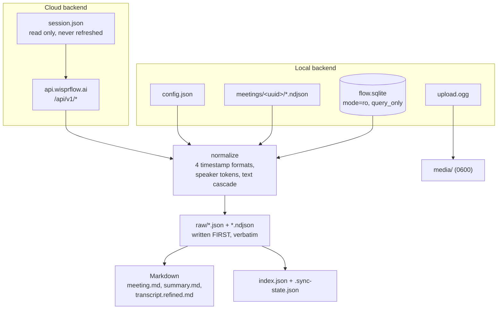

# wispr-flow-exporter

Local, incremental archive of Wispr Flow dictation history, meetings,
transcripts, speakers and custom dictionary — read straight from the app's own
SQLite store, with the sync API as a second backend for the data that never
reaches disk.

> **Status:** in development. The build sequence is tracked in `changelog.txt`;
> until v0.1.0 is tagged, assume commands land incrementally.

## Why this exists

- **Wispr Flow deletes things.** `Meetings.transcriptDeletedAt` exists,
  transcript retention is configurable per account and enforceable by an
  organization, and the app keeps exactly **one** rolling backup — the ~140 other
  files in `backups/` are orphaned `.tmp-wal` and `.tmp-shm` stubs from a bug.
  There is no historical archaeology to fall back on.
- **Meeting audio is garbage-collected.** On the machine this was developed
  against, only **one of three** meetings still had its `upload.ogg`.
- **There is no export worth the name.** The app is the only reader of its own
  store.

An archive that survives all of that has to be a separate artifact, on your
disk, in formats you can still read in ten years.

## Two backends

| | Local store | Sync API |
| --- | --- | --- |
| Source | `~/Library/Application Support/Wispr Flow/` | `api.wisprflow.ai` |
| Auth | none | the app's existing Supabase session |
| Network | none | required |
| Dictation history | only when `localDataPolicy` records it | yes |
| Meeting audio | yes, while the app still has it | no |
| Stability | app schema, ~20 migrations/month | undocumented, unversioned |

The local backend is the primary one and is fully functional on its own. The
cloud backend exists for one reason: see the next section.

## The dictation-history caveat, up front

Wispr Flow has a privacy preference, `localDataPolicy`. When it is set to
`never_store` — which may be enforced by your organization — **dictation history
is never written to disk at all.** The `History` table is present but empty.

This is not a bug in this tool, and it is the reason `doctor` reports the policy
before you ever run a sync:

```
policy       : localDataPolicy = never_store   <-- DICTATION HISTORY IS NOT RECORDED
```

An archive that silently contains no dictation is indistinguishable from a
complete one, which is the worst failure mode an archival tool has. So the
policy and the moment it was observed are recorded in `.sync-state.json`, and the
archive can prove *why* it has no dictation for a given date range. Reaching that
data requires either changing the preference in Wispr Flow (which only affects
future dictations) or the cloud backend.

## How it works



Raw payloads are written **before** anything is rendered, so a template change
never requires re-reading the source. That is what makes `wispr-export render` a
first-class command: the whole archive can be re-rendered offline, with the
database path unset.

## Requirements

- macOS (the store path is macOS-only today; Windows and Linux paths are
  isolated in one module for a future port)
- Wispr Flow installed, with data in `~/Library/Application Support/Wispr Flow/`
- Python ≥ 3.13
- [`uv`](https://docs.astral.sh/uv/)

## Install

```bash
git clone git@github.com:junxit/wispr-flow-exporter.git
cd wispr-flow-exporter
uv sync
cp .env.example .env   # optional; every setting has a working default
```

## Run

```bash
# What is on this machine, what policy is in force, what a sync would cost.
# Never writes anything.
uv run wispr-export doctor

# Archive everything the local store holds.
uv run wispr-export sync

# Just meetings, verbosely.
uv run wispr-export sync --only meetings -v

# Skip the audio (~16 MB per meeting).
uv run wispr-export sync --audio skip

# Include screen captures. Read the Security section before you do this.
uv run wispr-export sync --include-screen-context --i-understand

# Re-render Markdown from what is already archived. Touches no source at all.
uv run wispr-export render --force

# Reconcile the archive against the database.
uv run wispr-export verify --deep

# Include the cloud backend. It is never reached otherwise, not even when a
# valid session exists — it is an undocumented private API and calling it
# should be a decision, not a default.
uv run wispr-export sync --source both
```

There is no `login` and no `logout`. This tool never mints a credential of its
own, so it has none to store or discard — it borrows the token Wispr Flow
already holds, for the duration of one request. See *On the internal API*
below.

Re-running `sync` with nothing changed upstream must write **zero bytes**. That
is an asserted invariant, not an aspiration.

## Archive layout

```
archive/
  index.json                    # machine index, namespaced per entity
  .sync-state.json              # watermarks, schema pin, observed policy
  meetings/2026/08/2026-08-21--<slug>--<uuid>/
    meeting.md summary.md notes.md
    transcript.refined.md transcript.live.md
    raw/…                       # verbatim JSON and NDJSON
    media/upload.ogg
  notes/  dictation/  dictionary/  calendar/  account/  tables/
```

Frontmatter is Obsidian-friendly: `aliases` so `[[` autocomplete finds a meeting
whose filename ends in a UUID, hierarchical `tags` (`wispr/meeting`), and
`participants` as a YAML list.

## Retention guarantees

- **Nothing is ever deleted.** A record that disappears upstream is flagged
  `missing_since`; a soft-deleted one is flagged `deleted: true` and still
  rendered.
- **A transcript Wispr Flow deletes stays in your archive**, flagged
  `transcript_deleted_upstream: true`. This is the whole point of the tool.
- **A retitle moves the directory** rather than duplicating it.

## Configuration

See `.env.example` for the full set. Precedence is **CLI flag > environment >
`.env` > default**.

| Variable | Default | Purpose |
| --- | --- | --- |
| `WISPR_DATA_DIR` | auto-detected | Wispr Flow application-support directory |
| `WISPR_DB_PATH` | `<data dir>/flow.sqlite` | Database to read; point at a backup or Time Machine copy |
| `WISPR_SYNC_SOURCE` | `auto` | `local`, `cloud`, `both`, `auto`. `auto` is local-only; the cloud backend is never reached without asking |
| `WISPR_ARCHIVE_DIR` | `./archive` | Where the archive is written |
| `WISPR_AUDIO` | `copy` | `copy`, `link`, `skip` |
| `WISPR_INCLUDE_SCREEN_CONTEXT` | `0` | Screenshots and accessibility captures |
| `WISPR_STRICT_SCHEMA` | `0` | Exit non-zero on additive schema drift |

## Known limitations

- **Dictation history may be empty by policy.** See above.
- **Schema drift is continuous.** Wispr Flow shipped 11 migrations in August, 21
  in July and 25 in June. The raw path is schema-driven — rows are dumped via
  `PRAGMA table_info`, so a column added in migration 150 is archived on the next
  run with no code change — but *renderers* can fall behind. Additive drift warns
  and completes; breaking drift still archives raw and exits non-zero naming what
  broke. For an archival tool, "fail loud" must never mean "fail closed."
- **Live-transcript speaker names are wrong, and are not used.** `live.ndjson`
  carries a `speaker.name` populated from the meeting platform's active-speaker
  marker, which lags — a verified line in the development dataset attributes one
  participant's words to the other. Live turns are labelled mechanically
  (`mic#1`, `system#1001`) and the refined pass is the only source of names.
- **No historical archaeology.** Only one backup database is retained upstream.
  This tool can only archive what exists on the day you first run it.

### On the internal API

The desktop app talks to `api.wisprflow.ai`, which is **undocumented and not a
public product surface**. It authenticates with the app's own Supabase session
from `session.json` — a plaintext file, mode `0666`, holding a bearer
`access_token` and a `refresh_token`, with no keychain entry guarding it.

This tool reads that access token and **never calls the refresh endpoint**.
Supabase GoTrue rotates refresh tokens and detects reuse, so a second client that
refreshes would invalidate the desktop app's own session and sign you out of
Wispr Flow. The cost is that cloud sync only works when the app has refreshed
recently; when the token has expired, open Wispr Flow and re-run. That is the
correct trade, and no refresh code path exists to be reached by accident.

An undocumented endpoint can also change shape without notice, which is why the
local store is the primary backend and the cloud backend is confined to three
lazily-imported modules — and why it archives responses **verbatim** under
`cloud/`, one file per endpoint, rather than reshaping them into the local
layout. Guessing at an unconfirmed schema would produce an archive that looks
structured and is quietly wrong the first time a field is renamed. The client
issues `GET` only; there is no code path that writes to Wispr Flow's servers,
and a cloud pass that cannot reach one is reported without discarding a
successful local run.

`wispr-flow-exporter` is not affiliated with, endorsed by, or supported by Wispr
Flow. It reads files that Wispr Flow wrote to your own disk, under your own
account. Your use of Wispr Flow remains governed by their terms; you are
responsible for your own compliance with them, and with the recording-consent law
of your jurisdiction.

## Security

The archive is the most sensitive thing this tool produces: verbatim transcripts
of real conversations, everything you have dictated, and — if you opt in — screen
captures taken while you spoke. Files are written `0600` in `0700` directories,
`archive/` is gitignored, screen context requires two explicit flags, and the
session token is never copied into the archive or printed.

Note that an archive also contains **other people's** voices and words. Sharing
one is a disclosure decision about people who are not in the room.

See [SECURITY.md](SECURITY.md) for the full threat model.

## Test

```bash
uv run pytest -q
```

The suite runs fully offline: no network, no database on this machine, no
credentials. SQLite sources are built in `tmp_path` from real DDL held as string
constants in `conftest.py` — the thing under test *is* SQLite metadata, so
faking it with a stub object would fake the test. No transcript, audio or image
file is ever committed; every fixture is a Python literal.

`tests/test_privacy.py` enforces that: it fails on real names, absolute home
paths, JWT-shaped strings, and any UUID outside an approved fixture table.

## Delete

```bash
# Remove the archive (this is the only thing worth keeping — be sure).
rm -rf archive/

# Remove the virtualenv and caches.
rm -rf .venv .pytest_cache

# Remove the whole checkout.
cd .. && rm -rf wispr-flow-exporter
```

Nothing is installed outside the checkout at all — this tool stores no
credential of its own, so there is nothing else to clean up. It never modifies
Wispr Flow's own data either, so uninstalling it leaves the app exactly as it
was.

## Assumptions

- You are archiving **your own** Wispr Flow account on **your own** machine.
- Wispr Flow's local store stays plain SQLite plus NDJSON. If it is ever
  encrypted the way Granola's now is, the local backend stops working and only
  the cloud backend remains.
- Migration numbering stays monotonic, so `SequelizeMeta` is a usable schema pin.
- The archive lives on a filesystem that supports POSIX modes; `0600` is a
  documented guarantee.

## License

Source-available under the [PolyForm Noncommercial License 1.0.0](https://polyformproject.org/licenses/noncommercial/1.0.0/).

You may use, modify and share `wispr-flow-exporter` for any **noncommercial**
purpose — personal use, research, education, and nonprofit, public and government
use are all covered. **Any commercial use requires a separate license** from the
copyright holder.

This is *source-available*, not open source: it restricts commercial use.
Copyright © 2026 Jade Naaman. For a commercial license, contact the copyright
holder. See [LICENSE](LICENSE.md) for full terms.
