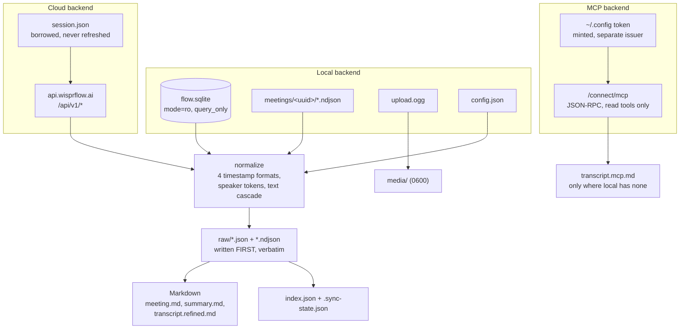

# wispr-flow-exporter

Local, incremental archive of Wispr Flow dictation history, meetings,
transcripts, speakers and custom dictionary — read straight from the app's own
SQLite store, with the sync API and the remote MCP server as second and third
backends for what never reaches disk, or no longer does.

## Why this exists

- **Wispr Flow deletes things.** `Meetings.transcriptDeletedAt` exists,
  transcript retention is configurable per account and enforceable by an
  organization, and the app keeps exactly **one** rolling backup — the ~140 other
  files in `backups/` are orphaned `.tmp-wal` and `.tmp-shm` stubs from a bug.
  There is no historical archaeology to fall back on.
- **Meeting audio is garbage-collected.** On the machine this was developed
  against, only **one of three** meetings still had its `upload.ogg`.
- **There is no export worth the name.** The app is the only reader of its own
  store.

An archive that survives all of that has to be a separate artifact, on your
disk, in formats you can still read in ten years.

## Three backends

| | Local store | Sync API | MCP server |
| --- | --- | --- | --- |
| Source | `~/Library/Application Support/Wispr Flow/` | `api.wisprflow.ai` | `api.wisprflow.ai/connect/mcp` |
| Auth | none | the app's existing Supabase session | OAuth, its own token — `wispr-export login` |
| Network | none | required | required |
| Dictation text | only when `localDataPolicy` records it | **no — see below** | **no** |
| Dictation totals | no | yes (counts, durations, streaks, per-day activity) | no |
| Meetings | yes | **no** — not readable | **yes, with transcripts** |
| Notes | yes | **no** — not readable | yes |
| Meeting audio | yes, while the app still has it | no | no |
| Transcript fidelity | raw turns, speakers, timestamps | — | normalized plaintext only |
| Stability | app schema, ~20 migrations/month | undocumented, unversioned | versioned, but no stability promise |
| Confirmed live | yes | yes, on app 1.6.721 | yes, on `wispr-meetings` 1 |

The local backend is the primary one and is fully functional on its own. The two
remote backends are reached only when you ask for them, and each announces
itself before it makes a request.

The MCP backend exists for one thing the other two cannot do: **recover a
transcript the local store no longer has.** Wispr Flow garbage-collects meeting
artifacts — on the machine this was developed against, only one of three
meetings still had its recording — and MCP still serves the transcript. It is a
*lower fidelity* source (normalized plaintext, no speaker attribution, no
timestamps), so it never replaces a local rendering; it fills a gap and says so
in the file it writes.

All three are confirmed against a live account. For the cloud backend that meant
finding out it had never worked: it sent `Authorization: Bearer <token>`, and
the service accepts only the bare token, so every one of its nine endpoints
returned `401`. It also had four wrong paths. Both are fixed, and 18 endpoints
are archived with their real status recorded. What that confirmation mostly
established, though, is what the sync API *cannot* do — the next section.

## The dictation-history caveat, up front

Wispr Flow has a privacy preference, `localDataPolicy`. When it is set to
`never_store` — which may be enforced by your organization — **dictation history
is never written to disk at all.** The `History` table is present but empty.

**The server cannot give it back.** This was the reason the cloud backend was
built, and it does not work: dictation is upload-only. Wispr Flow's own sync
coordinator sorts its resources into a pull list and a push list, and `history`,
`polish` and `instructHistory` are all in the push list. The records leave your
machine and there is no endpoint that returns them. Nothing in the application
bundle reads them back.

So, plainly:

> **If `localDataPolicy` is `never_store`, your past dictation text is not
> archivable by this tool or any other. Change the preference in Wispr Flow, and
> everything you dictate from that point on becomes archivable. What was already
> said is gone.**

`doctor` reports the policy before you ever run a sync, because an archive that
silently contains no dictation is indistinguishable from a complete one — the
worst failure mode an archival tool has:

```
policy       : localDataPolicy = never_store   <-- DICTATION HISTORY IS NOT RECORDED
```

The policy and the moment it was observed are recorded in `.sync-state.json`, so
the archive can prove *why* it has no dictation for a given date range.

What the cloud backend *can* reach is the aggregate shadow of that dictation:
word counts, total duration, day and week streaks, words per minute, per-day
activity, most-used and most-removed words. Five endpoints' worth, archived
under `cloud/`. It is not what you said. It is the only surviving evidence that
you said it.

Meetings, notes and todos are not readable from the cloud either — the app syncs
all three through write methods this tool does not issue. The local store is
their primary route; the MCP backend reaches meetings and notes, and is the only
way to recover a transcript the local store has lost.

The MCP server has no dictation access either, and Wispr Flow says so itself in
the settings copy that describes it. Three independent confirmations now agree,
so that question is closed.

[MAINTENANCE.md](MAINTENANCE.md) records how each of these conclusions was
reached, and how to re-check them when Wispr Flow updates.

## How it works



Raw payloads are written **before** anything is rendered, so a template change
never requires re-reading the source. That is what makes `wispr-export render` a
first-class command: the whole archive can be re-rendered offline, with the
database path unset.

## Requirements

- macOS (the store path is macOS-only today; Windows and Linux paths are
  isolated in one module for a future port)
- Wispr Flow installed, with data in `~/Library/Application Support/Wispr Flow/`
- Python ≥ 3.13
- [`uv`](https://docs.astral.sh/uv/)

## Install

```bash
git clone git@github.com:junxit/wispr-flow-exporter.git
cd wispr-flow-exporter
uv sync
cp .env.example .env   # optional; every setting has a working default
```

## Run

Run it with no arguments and it asks. Every setting is shown with its default,
each can be changed in place, and the run is summarized — along with the
equivalent command line — before anything is written:

```
$ wispr-export
  Wispr Flow data directory [auto-detect]:
  Archive directory [./archive]:
  Backend  all / local / cloud / mcp / both [all]:
  Entities to archive [all]:
  ...
  Equivalent command:
    wispr-export sync --source all --audio copy
  Proceed? [yes]:
```

Or pass the flags directly:

```bash
# What is on this machine, what policy is in force, what a sync would cost.
# Never writes anything.
uv run wispr-export doctor

# Archive from every backend that is ready. Local always; cloud and MCP when
# a credential exists for them.
uv run wispr-export sync

# Just meetings, verbosely.
uv run wispr-export sync --only meetings -v

# Skip the audio (~16 MB per meeting).
uv run wispr-export sync --audio skip

# Include screen captures. Read the Security section before you do this.
uv run wispr-export sync --include-screen-context --i-understand

# Re-render Markdown from what is already archived. Touches no source at all.
uv run wispr-export render --force

# Reconcile the archive against the database.
uv run wispr-export verify --deep

# Every backend that is ready. This is the default: local always, plus cloud
# and MCP where a credential exists. Each run says which it will contact
# before it contacts any of them, and one that is not authorized is skipped
# rather than reported as a failure.
uv run wispr-export sync --source all

# Or name one. Naming a backend explicitly makes a missing credential an
# error rather than a skip, which is what you want in a scripted run.
uv run wispr-export sync --source local   # offline; touches no network at all
uv run wispr-export sync --source cloud
uv run wispr-export sync --source mcp
```

Two backends borrow and one mints. The local store needs no credential, and the
sync API borrows the token Wispr Flow already holds for the duration of one
request — neither has anything to store or discard.

The MCP server is different: it is a separate OAuth resource with a separate
issuer, and it rejects the borrowed token outright. So it gets `login` and
`logout`, and it is the only thing in this tool that keeps a credential:

```bash
uv run wispr-export login    # opens a browser once; stores a token 0600
uv run wispr-export logout   # deletes it
```

The token lives in `~/.config/wispr-flow-exporter/`, deliberately outside the
archive, so an archive you copy or share still carries no credential. See *On
the internal API* below.

Every `sync` pulls whatever it has not pulled yet: each entity carries its own
watermark, so a run reads only what changed. Re-running with nothing changed
upstream writes **zero bytes** — an asserted invariant, not an aspiration.

The archive is never committable. If it sits inside a git working tree that
does not already ignore it, `sync` adds it to that repository's `.gitignore`
before writing anything. A warning printed once at the top of a long run is a
control that works exactly until somebody scrolls.

## Archive layout

```
archive/
  index.json                    # machine index, namespaced per entity
  .sync-state.json              # watermarks, pins, app version, observed
                                # policy, per-endpoint response shapes
  meetings/2026/08/2026-08-21--<slug>--<uuid>/
    meeting.md summary.md notes.md
    transcript.refined.md transcript.live.md
    raw/…                       # verbatim JSON and NDJSON
    media/upload.ogg
  notes/  dictation/  dictionary/  calendar/  account/  tables/
  cloud/                        # one verbatim response per endpoint
  mcp/                          # verbatim MCP responses, content-addressed
    meetings/                   # meetings upstream has and the local store does not
  meetings/…/transcript.mcp.md  # a transcript recovered when local had none
  meetings/…/raw/mcp/           # its verbatim chunks and manifest
```

Both backends record the Wispr Flow build that produced the archive
(`prefs.version`, `1.6.721` here), because a future reader looking at these
files otherwise has no way to tell which client wrote them.

Frontmatter is Obsidian-friendly: `aliases` so `[[` autocomplete finds a meeting
whose filename ends in a UUID, hierarchical `tags` (`wispr/meeting`), and
`participants` as a YAML list.

## Retention guarantees

- **Nothing is ever deleted.** A record that disappears upstream is flagged
  `missing_since`; a soft-deleted one is flagged `deleted: true` and still
  rendered.
- **A transcript Wispr Flow deletes stays in your archive**, flagged
  `transcript_deleted_upstream: true`. This is the whole point of the tool.
- **A retitle moves the directory** rather than duplicating it.

## Configuration

See `.env.example` for the full set. Precedence is **CLI flag > environment >
`.env` > default**.

| Variable | Default | Purpose |
| --- | --- | --- |
| `WISPR_DATA_DIR` | auto-detected | Wispr Flow application-support directory |
| `WISPR_DB_PATH` | `<data dir>/flow.sqlite` | Database to read; point at a backup or Time Machine copy |
| `WISPR_SYNC_SOURCE` | `auto` | `local`, `cloud`, `both`, `auto`. `auto` is local-only; the cloud backend is never reached without asking |
| `WISPR_ARCHIVE_DIR` | `./archive` | Where the archive is written |
| `WISPR_AUDIO` | `copy` | `copy`, `link`, `skip` |
| `WISPR_INCLUDE_SCREEN_CONTEXT` | `0` | Screenshots and accessibility captures |
| `WISPR_STRICT_SCHEMA` | `0` | Exit non-zero on additive schema drift |

### Commands

| Command | Purpose |
| --- | --- |
| `doctor` | Report the source, schema, policy and archive. Writes nothing. |
| `sync` | Archive new and changed data. |
| `schema` | Show the live schema against the declaration. Writes nothing. |
| `login` / `logout` | Authorize against the MCP server, or discard the token. The only credential this tool keeps. |
| `schema --source cloud` | Probe the live API and report its response shapes against the declaration. `GET` only; writes nothing, to the archive or to Wispr Flow. Add `--candidates` to also probe paths not yet adopted. |
| `schema --source mcp` | Handshake with the MCP server and report its tools against the pin. Calls no tool; writes nothing. |
| `verify` | Check integrity and reconcile against the database. |
| `render` | Re-render Markdown from archived payloads, with no source access. |

## Known limitations

- **Dictation text may be permanently unrecoverable.** See above. Neither
  backend can reach it once `localDataPolicy` is `never_store`.
- **The cloud backend cannot enumerate meetings, notes or todos.** All three are
  synced by the app through write methods this tool does not issue.
- **Four cloud endpoints paginate and this tool does not page them.** It detects
  the markers and reports `MORE RECORDS EXIST upstream than archived` rather
  than archiving one page quietly. Every one returned a complete single page on
  the account it was measured against, which is a fact about that account and
  not a guarantee about yours.
- **The sync API can change without notice, and will.** It is versioned only by
  the desktop app's build number. [MAINTENANCE.md](MAINTENANCE.md) is the
  runbook for when it moves.
- **Schema drift is continuous.** Wispr Flow shipped 11 migrations in August, 21
  in July and 25 in June. The raw path is schema-driven — rows are dumped via
  `PRAGMA table_info`, so a column added in migration 150 is archived on the next
  run with no code change — but *renderers* can fall behind. Additive drift warns
  and completes; breaking drift still archives raw and exits non-zero naming what
  broke. For an archival tool, "fail loud" must never mean "fail closed."
- **Live-transcript speaker names are wrong, and are not used.** `live.ndjson`
  carries a `speaker.name` populated from the meeting platform's active-speaker
  marker, which lags — a verified line in the development dataset attributes one
  participant's words to the other. Live turns are labelled mechanically
  (`mic#1`, `system#1001`) and the refined pass is the only source of names.
- **No historical archaeology.** Only one backup database is retained upstream.
  This tool can only archive what exists on the day you first run it.

### On the internal API

The desktop app talks to `api.wisprflow.ai`, which is **undocumented and not a
public product surface**. It authenticates with the app's own Supabase session
from `session.json` — a plaintext file, mode `0666`, holding a bearer
`access_token` and a `refresh_token`, with no keychain entry guarding it.

This tool reads that access token and **never calls the refresh endpoint**.
Supabase GoTrue rotates refresh tokens and detects reuse, so a second client that
refreshes would invalidate the desktop app's own session and sign you out of
Wispr Flow. The cost is that cloud sync only works when the app has refreshed
recently; when the token has expired, open Wispr Flow and re-run. That is the
correct trade, and no refresh code path exists to be reached by accident.

An undocumented endpoint can also change shape without notice, which is why the
local store is the primary backend and the cloud backend is confined to four
lazily-imported modules — and why it archives responses **verbatim** under
`cloud/`, one file per endpoint, rather than reshaping them into the local
layout. Guessing at a schema nobody publishes would produce an archive that
looks structured and is quietly wrong the first time a field is renamed. The
client issues `GET` only; there is no code path that writes to Wispr Flow's
servers, and a cloud pass that cannot reach one is reported without discarding a
successful local run.

Because nothing upstream will announce a change, the cloud backend fingerprints
every response's *structure* — field names and types, never values or counts —
and stores the digest in `.sync-state.json`. A changed shape is then reported
rather than silently absorbed, and classified the same four ways the local
backend classifies schema drift: `ok`, `additive`, `breaking`, `stale_source`.
Breaking drift still archives everything reachable and exits non-zero naming
what broke. `wispr-export schema --source cloud` runs that check on its own,
writing nothing. The procedure for acting on it is in
[MAINTENANCE.md](MAINTENANCE.md).

Three endpoints are declared knowing they cannot answer — `/api/v1/meetings/`
returns `404`, and the two `*/sync` paths return `405` — so that every run
records the fact. They are reported as one line and are not counted as
failures; a permanent `FAILED` on every run is how an operator learns to stop
reading the word.

`wispr-flow-exporter` is not affiliated with, endorsed by, or supported by Wispr
Flow. It reads files that Wispr Flow wrote to your own disk, under your own
account. Your use of Wispr Flow remains governed by their terms; you are
responsible for your own compliance with them, and with the recording-consent law
of your jurisdiction.

## Security

The archive is the most sensitive thing this tool produces: verbatim transcripts
of real conversations, everything you have dictated, and — if you opt in — screen
captures taken while you spoke. Files are written `0600` in `0700` directories,
`archive/` is gitignored, screen context requires two explicit flags, and the
session token is never copied into the archive or printed.

Note that an archive also contains **other people's** voices and words. Sharing
one is a disclosure decision about people who are not in the room.

See [SECURITY.md](SECURITY.md) for the full threat model.

## Test

```bash
uv run pytest -q
```

The suite runs fully offline: no network, no database on this machine, no
credentials. SQLite sources are built in `tmp_path` from real DDL held as string
constants in `conftest.py` — the thing under test *is* SQLite metadata, so
faking it with a stub object would fake the test. No transcript, audio or image
file is ever committed; every fixture is a Python literal.

`tests/test_privacy.py` enforces that: it fails on real names, absolute home
paths, JWT-shaped strings, and any UUID outside an approved fixture table.

## Delete

```bash
# Remove the archive (this is the only thing worth keeping — be sure).
rm -rf archive/

# Remove the virtualenv and caches.
rm -rf .venv .pytest_cache

# Remove the MCP credential (or run: wispr-export logout).
rm -rf ~/.config/wispr-flow-exporter

# Remove the whole checkout.
cd .. && rm -rf wispr-flow-exporter
```

One thing lives outside the checkout: the MCP credential, at
`~/.config/wispr-flow-exporter/`. `wispr-export logout` removes it, or delete
the directory. Nothing else is installed anywhere, and the tool never modifies
Wispr Flow's own data, so uninstalling it leaves the app exactly as it was.

## Assumptions

- You are archiving **your own** Wispr Flow account on **your own** machine.
- Wispr Flow's local store stays plain SQLite plus NDJSON. If it is ever
  encrypted the way Granola's now is, the local backend stops working and only
  the cloud backend remains.
- Migration numbering stays monotonic, so `SequelizeMeta` is a usable schema pin.
- The archive lives on a filesystem that supports POSIX modes; `0600` is a
  documented guarantee.

## License

Source-available under the [PolyForm Noncommercial License 1.0.0](https://polyformproject.org/licenses/noncommercial/1.0.0/).

You may use, modify and share `wispr-flow-exporter` for any **noncommercial**
purpose — personal use, research, education, and nonprofit, public and government
use are all covered. **Any commercial use requires a separate license** from the
copyright holder.

This is *source-available*, not open source: it restricts commercial use.
Copyright © 2026 Jade Naaman. For a commercial license, contact the copyright
holder. See [LICENSE](LICENSE.md) for full terms.
